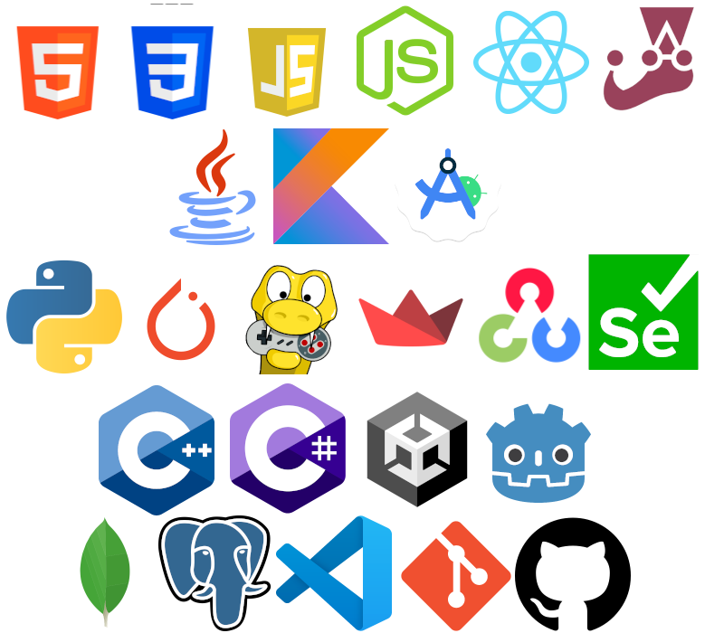

# Hello! I am Sarah Visconsini Diniz

Welcome to my GitHub profile! I'm passionate about technology and always eager to learn, share knowledge and discover new things! Here's a little bit about me:
---
## 📝 About me:
- 🎓 Recently graduated in Computer Science.
- 🖥️ Previous worked with WebDev, GameDev and Data analysis.
- 🌱 Always willing to learn new technologies and expand my knowledges.
- 💡 Curious and creative fast learner transgender woman.
---
## 🔗 Connect with me:
- 📧 E-mail: viniviscdiniz@gmail.com
- 📞 Phone: +55 (44) 99114-1144
- 💼 [Linkedin](https://www.linkedin.com/in/vin%C3%ADcius-visconsini-diniz-8001081bb/)
---
## 🛠️ Skills:

---
## 📊 Github Stats:

---
## 📦 Repositories:
Feel free to explore my projects. I enjoy working with:
- Java
- Python
- Javascript
- C/C++
- Discord Bots
- Data Analysis and AI
- Physics and Graphics Simulations
- Games
- Algoirthm Testing 
---
Thanks for stopping by! 😊
